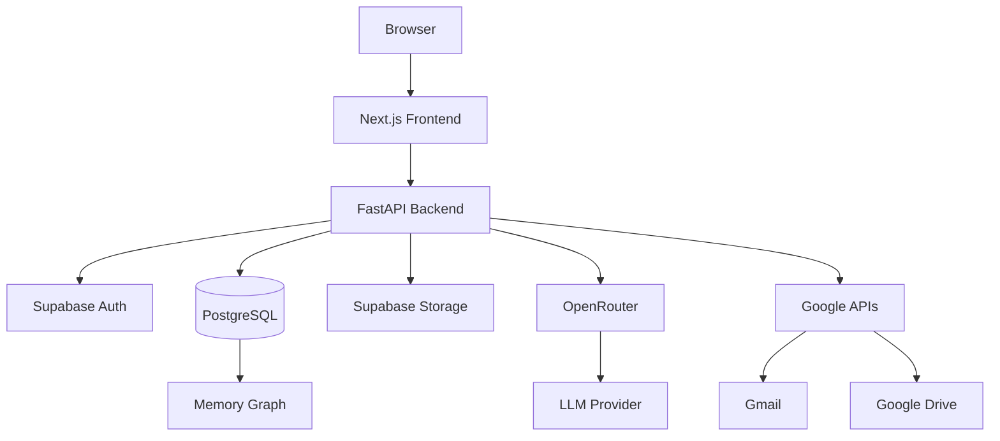
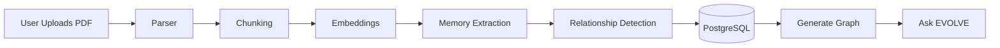

# EVOLVE AI

<p align="center">
  
</p>

<p align="center">
  <b>AI Memory Operating System</b>
  <br />
  <i>An AI-powered digital memory platform that connects your documents, emails, conversations, and knowledge into a searchable semantic memory graph.</i>
</p>

<p align="center">
  <a href="#-features">Features</a> •
  <a href="#-tech-stack">Tech Stack</a> •
  <a href="#-quick-start">Quick Start</a> •
  <a href="#-architecture">Architecture</a> •
  <a href="#-contributing">Contributing</a>
</p>

<p align="center">
  
  
  
  
  
  
  
  
</p>

---

## 📋 Project Overview

**EVOLVE AI** is a digital memory operating system designed to help you organize, search, and interact with your personal knowledge graph. Unlike traditional chat interfaces that forget context after each session, EVOLVE AI builds a persistent, semantic memory of your documents, emails, conversations, and more.

### What makes EVOLVE AI different?

| Aspect | Traditional ChatGPT | EVOLVE AI |
|--------|---------------------|-----------|
| Memory | Session-based, ephemeral | Persistent, semantic memory graph |
| Knowledge | Generic training data | Your personal knowledge corpus |
| Context | Limited to current conversation | Full historical context and relationships |
| Integration | Standalone | Connects Gmail, Google Drive, local files, and more |

---

## ✨ Features

### Authentication & Security
- **Google OAuth**: Seamless sign-in with Google accounts
- **Email Login**: Traditional email/password authentication
- **Supabase Auth**: Industry-standard authentication and session management
- **Row Level Security (RLS)**: Secure data isolation between users
- **Protected Routes**: Automatic redirection for unauthenticated users

### Memory Graph & Knowledge Organization
- **Interactive Knowledge Graph**: Visualize entities and their relationships
- **Semantic Search**: Find information by meaning, not just keywords
- **Entity Extraction**: Automatically extracts people, projects, documents, technologies, and more
- **Relationship Detection**: Identifies connections between different pieces of information
- **Graph Visualization**: React Flow-based interactive graph with filters and search

### Document & Content Management
- **Document Upload**: Support for PDF, TXT, and other file formats
- **PDF Parsing**: Extract text and metadata from PDF documents
- **Google Drive Integration**: Sync files directly from Google Drive
- **Gmail Integration**: Sync emails and attachments
- **Vector Search**: Semantic search over your document corpus

### AI & Memory Capabilities
- **Chat with Documents**: Ask questions about your uploaded files
- **AI Memory Extraction**: Automatically extracts key insights and memories
- **Daily Summary**: Daily recap of your recent activities and memories
- **Retrieval-Augmented Generation (RAG)**: Grounded responses based on your personal knowledge
- **Timeline View**: Chronological view of your activities and memories

### User Interface
- **Responsive Design**: Works beautifully on all devices
- **Dark Theme**: Modern, eye-friendly dark mode
- **Smooth Animations**: Framer Motion-powered animations
- **Dashboard**: Central hub for your memory OS
- **Settings Panel**: Comprehensive settings management

---

## 🛠️ Tech Stack

### Frontend
- **Next.js 14**: React framework with App Router
- **React 18**: UI library
- **TypeScript**: Type-safe development
- **Tailwind CSS**: Utility-first CSS framework
- **Framer Motion**: Animation library
- **React Flow**: Graph visualization
- **Supabase Auth Helpers**: Authentication integration

### Backend
- **FastAPI**: Modern, fast (high-performance) web framework
- **SQLAlchemy 2.0**: SQL toolkit and ORM
- **Pydantic**: Data validation and settings management
- **Alembic**: Database migrations

### AI & Retrieval
- **OpenRouter**: Unified LLM API access
- **Embeddings**: Semantic vector embeddings
- **RAG Engine**: Retrieval-augmented generation

### Database & Storage
- **Supabase PostgreSQL**: Primary relational database
- **SQLite**: Local development fallback
- **Supabase Storage**: File storage

### Integrations
- **Google OAuth**: Gmail, Drive, Calendar
- **OpenRouter**: Multiple LLM providers

---

## 🏗️ Architecture



---

## 📁 Folder Structure

```
MemoryOS/
├── backend/                  # FastAPI backend
│   ├── app/
│   │   ├── models/          # SQLAlchemy models and Pydantic schemas
│   │   ├── repositories/    # Data access layer
│   │   ├── routers/         # API endpoints
│   │   ├── services/        # Business logic and AI services
│   │   ├── database.py      # Database connection and setup
│   │   ├── dependencies.py  # FastAPI dependencies (auth, DB)
│   │   ├── main.py          # FastAPI application entry point
│   │   └── supabase.py      # Supabase client setup
│   ├── migrations/          # Alembic database migrations
│   ├── requirements.txt     # Python dependencies
│   └── .env.example         # Example environment variables
├── frontend/                # Next.js frontend
│   ├── src/
│   │   ├── app/             # App Router pages
│   │   ├── components/      # React components
│   │   └── lib/             # Utility functions and API clients
│   ├── package.json         # Node.js dependencies
│   └── tsconfig.json        # TypeScript configuration
└── README.md                # This file
```

---

## 🧠 Memory Flow



---

## 🚀 Quick Start

### Prerequisites

- Python 3.11+
- Node.js 18+
- npm or yarn
- Supabase account
- OpenRouter API key

### 1. Clone the repository

```bash
git clone https://github.com/pv-tech28/MemoryOS.git
cd MemoryOS
```

### 2. Backend Setup

```bash
cd backend
python -m venv .venv
.venv\Scripts\activate  # Windows
# source .venv/bin/activate  # macOS/Linux
pip install -r requirements.txt
cp .env.example .env
# Edit .env with your credentials
```

### 3. Frontend Setup

```bash
cd frontend
npm install
# Configure Supabase credentials in frontend/src/lib/supabase.ts
```

### 4. Environment Variables

Create `backend/.env`:

```env
# Supabase
SUPABASE_URL=your_supabase_url
SUPABASE_SECRET_KEY=your_supabase_secret_key
DATABASE_URL=your_database_url
DIRECT_URL=your_direct_database_url

# OpenRouter
OPENROUTER_API_KEY=your_openrouter_api_key
LLM_PROVIDER=openrouter
OPENROUTER_MODEL=deepseek/deepseek-chat-v3-0324

# Google OAuth
GOOGLE_CLIENT_ID=your_google_client_id
GOOGLE_CLIENT_SECRET=your_google_client_secret
GOOGLE_REDIRECT_URI=http://localhost:8000/api/auth/google/callback

# Session
SESSION_SECRET_KEY=your_session_secret_key
```

### 5. Run the Application

**Backend:**
```bash
cd backend
python -m uvicorn app.main:app --reload --host 0.0.0.0 --port 8000
```

**Frontend:**
```bash
cd frontend
npm run dev
```

The application will be available at:
- Frontend: http://localhost:3000
- Backend API: http://localhost:8000
- API Docs: http://localhost:8000/docs

---

## 📊 Database Schema

Key tables in the PostgreSQL database:

| Table | Purpose |
|-------|---------|
| `users` | User profiles and authentication info |
| `documents` | Uploaded and synced documents |
| `document_chunks` | Chunked document text for RAG |
| `memories` | Extracted memories and insights |
| `graph_nodes` | Entities in the knowledge graph |
| `graph_edges` | Relationships between entities |
| `timeline_events` | Chronological events |
| `chat_sessions` | Chat history sessions |
| `chat_messages` | Individual chat messages |

---

## 🔌 API Endpoints

### Authentication
- `POST /api/auth/login` - User login
- `POST /api/auth/signup` - User signup
- `GET /api/auth/google/login` - Google OAuth login
- `GET /api/auth/google/callback` - Google OAuth callback

### Chat
- `POST /api/chat` - Send chat message
- `GET /api/chat/history` - Get chat history

### Memory Graph
- `GET /api/memory-graph` - Get memory graph
- `GET /api/memory-graph/nodes` - Get graph nodes
- `GET /api/memory-graph/edges` - Get graph edges

### Documents
- `POST /api/documents/upload` - Upload document
- `GET /api/documents` - List documents
- `DELETE /api/documents/:id` - Delete document

### Sources
- `GET /api/sources` - List connected sources
- `POST /api/sources/google/sync` - Sync Google sources

---

## 🗺️ Roadmap

### ✅ Completed
- [x] Supabase Authentication
- [x] Memory Graph Visualization
- [x] RAG System
- [x] Timeline View
- [x] PostgreSQL Migration
- [x] Semantic Search
- [x] Google Drive & Gmail Integration
- [x] Dark Theme UI

### 🚧 Upcoming
- [ ] Collaborative Memory
- [ ] Calendar Integration
- [ ] Voice Memory
- [ ] Mobile App
- [ ] Agentic Memory
- [ ] Memory Sharing
- [ ] Browser Extension
- [ ] Docker Deployment
- [ ] CI/CD Pipeline

---

## ⚡ Performance

- **FastAPI**: High-performance async backend
- **React**: Virtual DOM and efficient re-renders
- **Lazy Loading**: Components loaded on demand
- **Caching**: Optimized API responses
- **Optimized Queries**: Indexed database queries

---

## 🔒 Security

- **JWT Authentication**: Secure token-based auth
- **Supabase Auth**: Industry-standard identity management
- **Row Level Security**: Data isolation per user
- **Protected Routes**: Automatic auth checks
- **Secure APIs**: Input validation and error handling

---

## 🚀 Deployment

### Frontend
Deploy to Vercel, Netlify, or any static hosting provider.

### Backend
Deploy to Railway, Render, AWS, or any Python hosting platform.

### Database
Use Supabase PostgreSQL for production.

---

## 🤝 Contributing

Contributions are welcome! Please follow these steps:

1. Fork the repository
2. Create a new branch (`git checkout -b feature/amazing-feature`)
3. Commit your changes (`git commit -m 'Add some amazing feature'`)
4. Push to the branch (`git push origin feature/amazing-feature`)
5. Open a Pull Request

---

## 📄 License

Distributed under the MIT License. See `LICENSE` for more information.

---

## 👨‍💻 Developer

**Siddh Tyagi**
- GitHub: [@pv-tech28](https://github.com/pv-tech28)
- LinkedIn: [Siddh Tyagi](https://linkedin.com/in/siddh-tyagi)
- Portfolio: [siddhtyagi.com](https://siddhtyagi.com)

---

<p align="center">
  Built with ❤️ by Siddh Tyagi and Pratha Varshney
</p>
