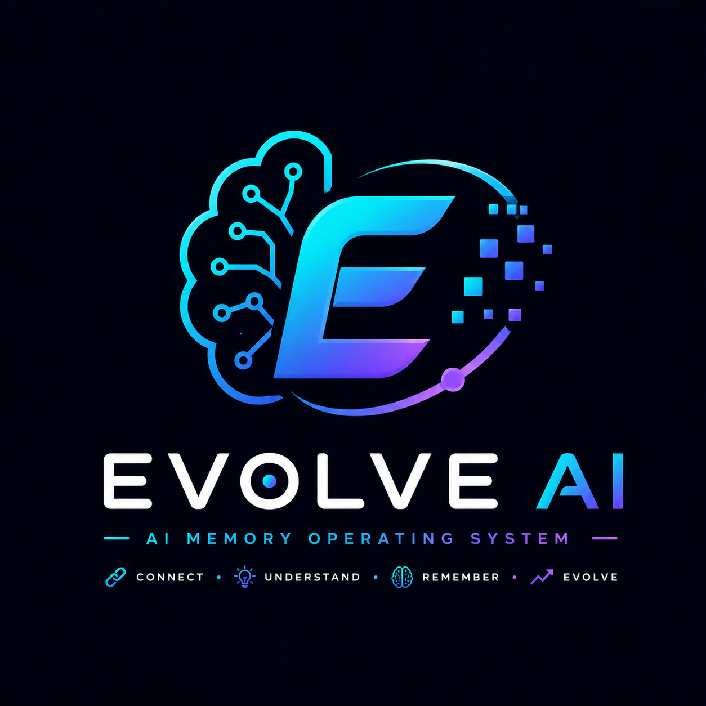
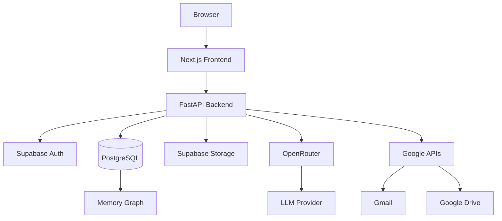
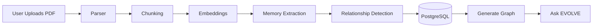

# EVOLVE AI

<p align="center">
  
</p>

<p align="center">
  <b>AI Memory Operating System</b>
  <br />
  <i>An AI-powered digital memory platform that connects your documents, emails, conversations, and knowledge into a searchable semantic memory graph.</i>
</p>

<p align="center">
  <a href="#-features">Features</a> •
  <a href="#-tech-stack">Tech Stack</a> •
  <a href="#-quick-start">Quick Start</a> •
  <a href="#-architecture">Architecture</a> •
  <a href="#-roadmap--development-plan">Roadmap & Plan</a> •
  <a href="#-contributing">Contributing</a>
</p>

<p align="center">
  
  
  
  
  
  
  
  
</p>

---

## 📋 Project Overview

**EVOLVE AI** is a digital memory operating system designed to help you organize, search, and interact with your personal knowledge graph. Unlike traditional chat interfaces that forget context after each session, EVOLVE AI builds a persistent, semantic memory of your documents, emails, conversations, and more.

### What makes EVOLVE AI different?

| Aspect | Traditional ChatGPT | EVOLVE AI |
|--------|---------------------|-----------|
| Memory | Session-based, ephemeral | Persistent, semantic memory graph |
| Knowledge | Generic training data | Your personal knowledge corpus |
| Context | Limited to current conversation | Full historical context and relationships |
| Integration | Standalone | Connects Gmail, Google Drive, local files, and more |

---

## ✨ Features

### Authentication & Security
- **Google OAuth**: Seamless sign-in with Google accounts
- **Email Login**: Traditional email/password authentication
- **Supabase Auth**: Industry-standard authentication and session management
- **Row Level Security (RLS)**: Secure data isolation between users
- **Protected Routes**: Automatic redirection for unauthenticated users

### Memory Graph & Knowledge Organization
- **Interactive Knowledge Graph**: Visualize entities and their relationships
- **Semantic Search**: Find information by meaning, not just keywords
- **Entity Extraction**: Automatically extracts people, projects, documents, technologies, and more
- **Relationship Detection**: Identifies connections between different pieces of information
- **Graph Visualization**: React Flow-based interactive graph with filters and search

### Document & Content Management
- **Document Upload**: Support for PDF, TXT, and other file formats
- **PDF Parsing**: Extract text and metadata from PDF documents
- **Google Drive Integration**: Sync files directly from Google Drive
- **Gmail Integration**: Sync emails and attachments
- **Vector Search**: Semantic search over your document corpus

### AI & Memory Capabilities
- **Chat with Documents**: Ask questions about your uploaded files
- **AI Memory Extraction**: Automatically extracts key insights and memories
- **Daily Summary**: Daily recap of your recent activities and memories
- **Retrieval-Augmented Generation (RAG)**: Grounded responses based on your personal knowledge
- **Timeline View**: Chronological view of your activities and memories

### User Interface
- **Responsive Design**: Works beautifully on all devices
- **Dark Theme**: Modern, eye-friendly dark mode
- **Smooth Animations**: Framer Motion-powered animations
- **Dashboard**: Central hub for your memory OS
- **Settings Panel**: Comprehensive settings management

---

## 🛠️ Tech Stack

### Frontend
- **Next.js 14**: React framework with App Router
- **React 18**: UI library
- **TypeScript**: Type-safe development
- **Tailwind CSS**: Utility-first CSS framework
- **Framer Motion**: Animation library
- **React Flow**: Graph visualization
- **Supabase Auth Helpers**: Authentication integration

### Backend
- **FastAPI**: Modern, fast (high-performance) web framework
- **SQLAlchemy 2.0**: SQL toolkit and ORM
- **Pydantic**: Data validation and settings management
- **Alembic**: Database migrations

### AI & Retrieval
- **OpenRouter**: Unified LLM API access
- **Embeddings**: Semantic vector embeddings
- **RAG Engine**: Retrieval-augmented generation

### Database & Storage
- **Supabase PostgreSQL**: Primary relational database
- **SQLite**: Local development fallback
- **Supabase Storage**: File storage

### Integrations
- **Google OAuth**: Gmail, Drive, Calendar
- **OpenRouter**: Multiple LLM providers

---

## 🏗️ Architecture


```mermaid
graph TD
    Browser[Browser] --> Frontend[Next.js Frontend]
    Frontend --> FastAPI[FastAPI Backend]
    FastAPI --> SupabaseAuth[Supabase Auth]
    FastAPI --> PostgreSQL[(PostgreSQL)]
    FastAPI --> SupabaseStorage[Supabase Storage]
    FastAPI --> OpenRouter[OpenRouter]
    FastAPI --> GoogleAPIs[Google APIs]
    PostgreSQL --> MemoryGraph[Memory Graph]
    OpenRouter --> LLM[LLM Provider]
    GoogleAPIs --> Gmail[Gmail]
    GoogleAPIs --> Drive[Google Drive]
```

---

## 📁 Folder Structure

```
MemoryOS/
├── backend/                  # FastAPI backend
│   ├── app/
│   │   ├── models/          # SQLAlchemy models and Pydantic schemas
│   │   ├── repositories/    # Data access layer
│   │   ├── routers/         # API endpoints
│   │   ├── services/        # Business logic and AI services
│   │   ├── database.py      # Database connection and setup
│   │   ├── dependencies.py  # FastAPI dependencies (auth, DB)
│   │   ├── main.py          # FastAPI application entry point
│   │   └── supabase.py      # Supabase client setup
│   ├── migrations/          # Alembic database migrations
│   ├── requirements.txt     # Python dependencies
│   └── .env.example         # Example environment variables
├── frontend/                # Next.js frontend
│   ├── src/
│   │   ├── app/             # App Router pages
│   │   ├── components/      # React components
│   │   └── lib/             # Utility functions and API clients
│   ├── package.json         # Node.js dependencies
│   └── tsconfig.json        # TypeScript configuration
└── README.md                # This file
```

---

## 🧠 Memory Flow


```mermaid
flowchart LR
    A[User Uploads PDF] --> B[Parser]
    B --> C[Chunking]
    C --> D[Embeddings]
    D --> E[Memory Extraction]
    E --> F[Relationship Detection]
    F --> G[(PostgreSQL)]
    G --> H[Generate Graph]
    H --> I[Ask EVOLVE]
```

---

## 🚀 Quick Start

### Prerequisites

- Python 3.11+
- Node.js 18+
- npm or yarn
- Supabase account
- OpenRouter API key

### 1. Clone the repository

```bash
git clone https://github.com/pv-tech28/MemoryOS.git
cd MemoryOS
```

### 2. Backend Setup

```bash
cd backend
python -m venv .venv
.venv\Scripts\activate  # Windows
# source .venv/bin/activate  # macOS/Linux
pip install -r requirements.txt
cp .env.example .env
# Edit .env with your credentials
```

### 3. Frontend Setup

```bash
cd frontend
npm install
# Configure Supabase credentials in frontend/src/lib/supabase.ts
```

### 4. Environment Variables

Create `backend/.env`:

```env
# Supabase
SUPABASE_URL=your_supabase_url
SUPABASE_SECRET_KEY=your_supabase_secret_key
DATABASE_URL=your_database_url
DIRECT_URL=your_direct_database_url

# OpenRouter
OPENROUTER_API_KEY=your_openrouter_api_key
LLM_PROVIDER=openrouter
OPENROUTER_MODEL=deepseek/deepseek-chat-v3-0324

# Google OAuth
GOOGLE_CLIENT_ID=your_google_client_id
GOOGLE_CLIENT_SECRET=your_google_client_secret
GOOGLE_REDIRECT_URI=http://localhost:8000/api/auth/google/callback

# Session
SESSION_SECRET_KEY=your_session_secret_key
```

### 5. Run the Application

**Backend:**
```bash
cd backend
python -m uvicorn app.main:app --reload --host 0.0.0.0 --port 8000
```

**Frontend:**
```bash
cd frontend
npm run dev
```

The application will be available at:
- Frontend: http://localhost:3000
- Backend API: http://localhost:8000
- API Docs: http://localhost:8000/docs

---

## 📊 Database Schema

Key tables in the PostgreSQL database:

| Table | Purpose |
|-------|---------|
| `users` | User profiles and authentication info |
| `documents` | Uploaded and synced documents |
| `document_chunks` | Chunked document text for RAG |
| `memories` | Extracted memories and insights |
| `graph_nodes` | Entities in the knowledge graph |
| `graph_edges` | Relationships between entities |
| `timeline_events` | Chronological events |
| `chat_sessions` | Chat history sessions |
| `chat_messages` | Individual chat messages |

---

## 🔌 API Endpoints

### Authentication
- `POST /api/auth/login` - User login
- `POST /api/auth/signup` - User signup
- `GET /api/auth/google/login` - Google OAuth login
- `GET /api/auth/google/callback` - Google OAuth callback

### Chat
- `POST /api/chat` - Send chat message
- `GET /api/chat/history` - Get chat history

### Memory Graph
- `GET /api/memory-graph` - Get memory graph
- `GET /api/memory-graph/nodes` - Get graph nodes
- `GET /api/memory-graph/edges` - Get graph edges

### Documents
- `POST /api/documents/upload` - Upload document
- `GET /api/documents` - List documents
- `DELETE /api/documents/:id` - Delete document

### Sources
- `GET /api/sources` - List connected sources
- `POST /api/sources/google/sync` - Sync Google sources

---

## 🗺️ Roadmap & Development Plan

An in-depth breakdown of what has been implemented so far and the roadmap of features and infrastructure planned next.

### ✅ What We've Done (Completed Milestones)

#### 🔐 Authentication, Authorization & Multi-Tenancy
- [x] **Supabase Authentication**: Full email and password signup, login, session persistence, and token verification.
- [x] **Google OAuth 2.0 Integration**: One-click Google sign-in with token handling for accessing Google services.
- [x] **Demo Mode & Guest Access**: Built-in demo authentication and middleware bypass for instant UI evaluation without requiring cloud credentials.
- [x] **User-Scoped Isolation**: Strict tenant isolation across all database queries ensuring users only see and query their own memory nodes, edges, and documents.
- [x] **Protected Routes**: Next.js client- and server-side middleware for automatic redirection of unauthenticated sessions.

#### 🧠 Semantic Memory & Knowledge Graph
- [x] **Interactive Memory Graph**: Force-directed, interactive visualization using React Flow and D3 (`/memory-graph`).
- [x] **Automated Entity & Relation Extraction**: Automatic identification of entities (People, Organizations, Projects, Concepts) and relationships from text using OpenRouter/DeepSeek.
- [x] **Graph Exploration Tools**: Search nodes, filter by entity type, inspect node details, and analyze connections.
- [x] **Dual Database Architecture**: Production-grade Supabase PostgreSQL support with an automatic SQLite fallback for lightweight local development.
- [x] **Database Seed Generator**: Standalone automated database seeding script (`backend/app/seed.py`) with rich sample graphs, timeline events, and memories for instant testing.

#### 🤖 Retrieval-Augmented Generation (RAG) & AI Engine
- [x] **Hybrid RAG Pipeline**: Combines vector retrieval with memory graph context to provide grounded, hallucination-resistant answers.
- [x] **Vector Embeddings & Semantic Search**: Fast, local vector embeddings with FastEmbed and FAISS-based vector storage.
- [x] **Document Ingestion & Chunking**: PyMuPDF integration for high-fidelity PDF parsing and recursive text chunking with metadata tracking.
- [x] **Persistent Chat Sessions**: Conversational history tracking (`/ask`) with context retention, prompt synthesis, and source document citations.

#### 🖥️ Modern Web Application & Modules
- [x] **Unified Dark-Themed Dashboard**: Live metrics for graph nodes, relationships, extracted memories, and connected sources.
- [x] **Interactive Query Hub (`/ask`)**: Clean AI chat interface with instant responses and source attribution.
- [x] **Timeline Visualization (`/timeline`)**: Chronological event feed displaying memory milestones and activity history.
- [x] **Daily Summary Digest (`/daily-summary`)**: Recap page highlighting daily key insights and conversational takeaways.
- [x] **Document Library & Upload (`/files`, `/upload`)**: Drag-and-drop document upload with processing status indicators.
- [x] **Sources & Integrations Hub (`/sources`, `/settings`)**: Configuration hub for Google Drive, Gmail, API keys, and model parameters.

---

### 🚧 What is Remaining (Planned & In Progress)

#### 🔄 1. Core Memory & Knowledge Evolution
- [ ] **Temporal Memory Decay & Reinforcement**: Implement memory weighting where frequently revisited facts remain prominent while outdated context fades gracefully.
- [ ] **Multi-Hop Graph Traversal**: Upgrade the RAG engine to traverse 2nd- and 3rd-degree relationship hops for complex associative queries.
- [ ] **Automated Memory Consolidation**: Scheduled background jobs to merge duplicate entities, reconcile alias names, and summarize dense clusters.
- [ ] **Contradiction Detection**: Detect when newly ingested documents or messages contradict prior facts and prompt the user or track belief updates.

#### 🌐 2. Data Connectors & Ingestion Pipeline
- [ ] **Continuous Background Syncing**: Webhooks and background workers (Celery/Temporal or async task schedulers) for automated Google Drive and Gmail sync.
- [ ] **Extended External Connectors**:
  - [ ] **Notion Connector**: Ingest pages, databases, and workspace notes.
  - [ ] **Slack / Discord Connector**: Ingest conversations, threads, and bookmarked messages.
  - [ ] **Obsidian / Local Markdown Vaults**: Native folder sync for personal knowledge management (PKM) users.
  - [ ] **Browser Extension (Chrome / Firefox)**: One-click web clipper to save highlighted text and web pages directly into MemoryOS.
- [ ] **Multimodal Ingestion**: OCR extraction for images, whiteboard diagrams, receipts, and handwritten notes.
- [ ] **Voice Memory & Audio Transcriptions**: Whisper integration to transcribe voice notes and recorded meetings into structured memories.

#### 🤖 3. Proactive & Agentic Capabilities
- [ ] **Proactive Context Agent**: Ambient memory assistant that surfaces relevant files, previous discussions, or people profiles ahead of scheduled calendar meetings.
- [ ] **IDE & Productivity Plugins**: Editor plugins (VS Code, JetBrains) allowing memory queries directly inside your development workflow.
- [ ] **Autonomous Weekly Digest**: Auto-generated comprehensive synthesis reports detailing knowledge growth, key decisions, and topic trends.

#### 👥 4. Collaboration & Team Workspaces
- [ ] **Shared Memory Spaces**: Team knowledge graphs with granular Role-Based Access Control (RBAC).
- [ ] **Selective Privacy Toggles**: Toggle individual memory nodes, edges, or documents between public, workspace, and strictly private.
- [ ] **Open Memory Export**: Export graph and memories to standard formats (JSON-LD, Neo4j graph dump, Markdown vault).

#### 🛡️ 5. Production Readiness, DevOps & Mobile
- [ ] **Docker & Docker Compose**: Full-stack containerized deployment (`docker-compose up`) for one-click self-hosting.
- [ ] **CI/CD Pipelines**: Automated GitHub Actions workflows for automated testing, linting, and build validation.
- [ ] **Automated Test Coverage**: Comprehensive unit, integration, and E2E test suite covering RAG, graph builder, and API endpoints.
- [ ] **Mobile Companion (PWA / React Native)**: Responsive mobile experience optimized for fast voice memos and on-the-go memory search.

---

## ⚡ Performance

- **FastAPI**: High-performance async backend
- **React**: Virtual DOM and efficient re-renders
- **Lazy Loading**: Components loaded on demand
- **Caching**: Optimized API responses
- **Optimized Queries**: Indexed database queries

---

## 🔒 Security

- **JWT Authentication**: Secure token-based auth
- **Supabase Auth**: Industry-standard identity management
- **Row Level Security**: Data isolation per user
- **Protected Routes**: Automatic auth checks
- **Secure APIs**: Input validation and error handling

---

## 🚀 Deployment

### Frontend
Deploy to Vercel, Netlify, or any static hosting provider.

### Backend
Deploy to Railway, Render, AWS, or any Python hosting platform.

### Database
Use Supabase PostgreSQL for production.

---

## 🤝 Contributing

Contributions are welcome! Please follow these steps:

1. Fork the repository
2. Create a new branch (`git checkout -b feature/amazing-feature`)
3. Commit your changes (`git commit -m 'Add some amazing feature'`)
4. Push to the branch (`git push origin feature/amazing-feature`)
5. Open a Pull Request

---

## 📄 License

Distributed under the MIT License. See `LICENSE` for more information.

---

## 👨‍💻 Developers

**Siddh Tyagi** & **Pratha Varshney**

---

<p align="center">
  Built with ❤️ by Siddh Tyagi and Pratha Varshney
</p>
